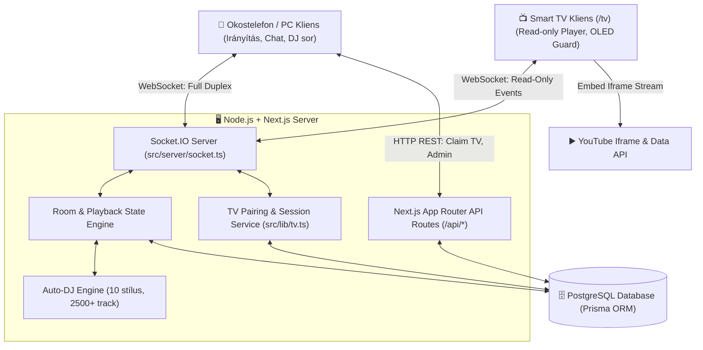

# AGENTS.md — AllYouTuber AI Agent & Developer Handoff Guide

Ez a dokumentum azért készült, hogy bármely új AI ágens vagy fejlesztő **előzetes háttérismeret nélkül** azonnal, biztonságosan és teljes kontextus birtokában tudja folytatni a munkát az **AllYouTuber** projekten.

---

## 1. PROJECT GOAL (A projekt célja)
Az **AllYouTuber** egy valós idejű, többfelhasználós közösségi YouTube zenehallgató és videómegosztó webalkalmazás (hasonló a plug.dj / dubtrack.fm rendszerekhez), amely dedikált **Smart TV (LG webOS, Samsung Tizen, Hisense VIDAA)** megjelenítési móddal és intelligens Auto-DJ motorral rendelkezik.

### Fő funkciók:
- **Zenei szobák (Rooms)**: Nyilvános és privát szobák létrehozása, PIN védelemmel, meghívó linkekkel (`/room/:slug`).
- **Valós idejű lejátszás szinkronizáció**: Központi szerver oldali időzítő (master clock), automatikus drift korrekció (±1,5s tolerancia).
- **Lejátszási sor (Queue) és DJ Slot rendszer**: Felhasználók beküldhetnek YouTube linkeket, DJ slotot foglalhatnak, szavazhatnak (Upvote / Downvote / Skip).
- **Auto-DJ motor**: 10 különféle zenei stílus (Rock, Metal, EDM, Rap, Latin, Jazz, Chill/Lo-Fi, Classic, Country, Mixed Party), stílusonként 250+ valós, beágyazható YouTube videóval, automatikus ismétlés-elkerüléssel és intelligens kitöltéssel.
- **Dedikált Smart TV mód (`/tv`, `/tv/:roomId`)**:
  - 16:9 YouTube fókuszú felület távirányító-barát UI-val.
  - 6 karakteres, tiszta párosító kód (`A7K4Q2`, kizárva a félreolvasható `0`, `O`, `I`, `1` karaktereket) + QR kód.
  - Mobil/Desktop felületről távolról vezérelhető, átnevezhető és lecsatlakoztatható.
  - OLED beégés elleni védelem (pixel-shift 45 másodpercenként).
  - Szigorúan **Read-Only (`TV_CLIENT`)**: a TV nem módosíthat szobaállapotot.
- **Többnyelvűség (i18n)**: 5 támogatott nyelv: Magyar (`hu`), Angol (`en`), Német (`de`), Orosz (`ru`), Francia (`fr`).
- **Rendszergazdai Admin felület (`/admin`)**: Felhasználók megtekintése, IP alapú geolokáció/ISP infó, admin névcsere, moderáció, szobák felügyelete.

---

## 2. CURRENT STATUS (Aktuális állapot)
- **Státusz**: Élesítésre kész (Production-ready).
- **Backend & Socket.IO**: Hibátlanul működik, valós idejű eseménykezeléssel és in-memory cache-sel megtámogatott PostgreSQL szinkronizációval.
- **Tesztek**: 13 tesztfájl / 64 unit teszt sikeresen lefut (`npm test` -> Exit code 0).
- **Build**: Next.js 14.2 App Router `npm run build` hiba nélkül fordul.
- **Git Branch**: `main` (naprakész a `https://github.com/zsirafmix/allyoutuber.git` távoli repóval).

---

## 3. LAST COMPLETED TASK (Legutóbb befejezett feladat)
- **Smart TV Megjelenítési Mód és Távoli Vezérlés**:
  - Teljes `/tv` és `/tv/:slug` útvonal megvalósítás.
  - `TvSession` modell és Prisma migráció (`src/lib/tv.ts`, `prisma/schema.prisma`).
  - SHA-256 párosító kód hashelés, 10 próbálkozás/perc/IP brute-force védelem.
  - Autoplay blokkolás feloldó gomb ("LEJÁTSZÁS INDÍTÁSA") Smart TV távirányítókhoz (OK / Enter gomb).
  - Mobil/desktop "TV Kijelző" modal a szobában a párosításhoz, listázáshoz, átnevezéshez és leválasztáshoz.
  - OLED pixel-shift és `?debug=1` overlay.

---

## 4. CURRENT TASK & 5. NEXT TASK (Aktuális és következő feladatok)
- **Aktuális feladat**: A projekt teljes, mélyreható dokumentálása a repóban az AI agent / fejlesztői handoff szabályok szerint.
- **Következő feladatok**:
  1. Éles Render környezetben való valós fizikai Smart TV tesztelés (LG webOS böngésző, Samsung Tizen böngésző).
  2. Valós idejű latency optimalizálás magas egyidejű felhasználószám esetén (opcionális Redis Adapter bekapcsolása).
  3. YouTube Iframe API hibaesemények finomítása (100, 101, 150 hibakódok esetén azonnali auto-skip).

---

## 6. IMPORTANT FILES & ROLES (Fontos fájlok és szerepük)

| Fájl | Szerepe és felelőssége | Függőségek | Mire figyelj módosításkor? |
|---|---|---|---|
| `src/server/socket.ts` | Központi Socket.IO szerver és szobaállapot-gép. Kezeli a lejátszást, időzítést, TV klienseket, chatet, szavazást. | `src/lib/dj-tracks.ts`, `src/lib/tv.ts`, Prisma | **KRITIKUS**: A `TV_CLIENT` socketeknél tilos engedélyezni szobamódosító műveleteket (`isTvClient` guard). |
| `src/lib/tv.ts` | TV párosítási logika, kódgenerálás, hashelés, rate limit, érvényesség-ellenőrzés. | `crypto`, Prisma Client | Ne engedj be zavaró karaktereket (`0, O, I, 1`). A kód mindig hashelve tárolódik az adatbázisban. |
| `src/components/tv/TvPlayer.tsx` | TV képernyő YouTube Iframe lejátszója, "Most játszik", "Következik" kártyák, OLED védelem, debug overlay. | YouTube Iframe API | TV böngészőkben a DOM manipuláció lassú lehet, tartsd minimálisan a reflow/repaint műveleteket! |
| `src/components/tv/TvPairingScreen.tsx` | TV párosító képernyő nagy kódkijelzéssel, QR kóddal és távirányító billentyűkezelővel. | `qrcode.react` | TV távirányító Enter/OK gomb (`keyCode 13`) eseménykezelése kötelező. |
| `src/components/TvManagerModal.tsx` | Mobil/Desktop modal a szobában a TV-k párosításához és menedzseléséhez. | REST API `/api/tv/*` | A szobában lévő felhasználóknak azonnal látniuk kell a csatlakoztatott TV-k állapotát. |
| `src/lib/dj-tracks.ts` | 10 zenei stílus Auto-DJ adatbázisa (250+ szám stílusonként). | Nincs | Csak beágyazható, valós YouTube video ID-kat tartalmazhat. |
| `src/lib/youtube.ts` | YouTube metaadat-lekérő és validáló (oEmbed fallbackkel). | YouTube API, `fetch` | Ha nincs `YOUTUBE_API_KEY`, az oEmbed és a scraper biztosítja a fallback működést. |
| `src/locales/*.json` | 5 nyelvű i18n szótárak (`hu`, `en`, `de`, `ru`, `fr`). | Next-intl / egyedi i18n | Bármilyen új UI szöveg esetén mind az 5 fájlba be kell vezetni az azonos kulcsot. |
| `prisma/schema.prisma` | Adatbázis séma (User, Room, QueueItem, ChatMessage, TvSession, AuditLog). | PostgreSQL | Módosítás után mindig futtatni kell: `npx prisma db push && npx prisma generate`. |

---

## 7. ARCHITECTURE SUMMARY & MERMAID DIAGRAM



---

## 8. HOW TO BUILD, RUN & TEST

### Környezeti követelmények:
- **Node.js**: `v20.x` vagy újabb (LTS ajánlott)
- **NPM**: `v10.x` vagy újabb
- **PostgreSQL**: `v14` vagy újabb
- **OS**: Linux / macOS / Windows WSL2

### Telepítés és Indítás:
```bash
# 1. Függőségek telepítése
npm install

# 2. Környezeti változók (.env) beállítása
cp .env.example .env

# 3. Adatbázis séma szinkronizálása és Prisma Client generálása
npx prisma db push
npx prisma generate

# 4. Fejlesztői szerver indítása (Next.js + Socket.IO egyben)
npm run dev

# 5. Éles build fordítása
npm run build

# 6. Éles szerver indítása
npm start
```

### Tesztek futtatása:
```bash
# Összes unit teszt futtatása (Vitest)
npm test

# Tesztek figyelő módban
npx vitest
```

---

## 9. IMPORTANT TECHNICAL DECISIONS & RATIONALES (Fontos döntések és indoklásuk)

1. **Egyetlen egyedi Node.js szerver (`server.ts`) Next.js és Socket.IO integrációval**:
   - *Probléma*: A valós idejű videószinkronizációhoz és a TV állapotkezeléshez szoros, alacsony késleltetésű WebSocket kapcsolat szükséges.
   - *Döntés*: Egyetlen Express/HTTP szerver futtatja a Next.js kéréseket és a Socket.IO kapcsolatokat.
   - *Elvetett alternatíva*: Különálló mikro-szerver (túl nagy üzemeltetési komplexitás, felesleges hálózati overhead).

2. **Read-Only TV kliensek (`TV_CLIENT`)**:
   - *Probléma*: A Smart TV böngészőkben a felhasználók nem autentikáltak, a TV nem kaphat jogosultságot szobamódosításra.
   - *Döntés*: A TV socket `isTvClient = true` jelölést kap. A szerver automatikusan ignorál minden mutációs kérést (pl. `queue:add`, `room:claim_slot`, szavazás), és csak passzív szobafrissítéseket küld neki.

3. **6 karakteres kizárásos párosító kód**:
   - *Döntés*: Csak `ABCDEFGHJKLMNPQRSTUVWXYZ23456789` karaktereket használunk. Kizárva: `0`, `O`, `I`, `1`, hogy TV-ről leolvasva telefonon véletlenül se lehessen elgépelni.

4. **Központi Master Clock videó szinkronizáció**:
   - *Döntés*: A szerver tartja számon a `playback.startedAt` időbélyeget és a `playback.pausedAt` állapotot. A kliensek a szerveridőhöz igazítják a YouTube lejátszót, és csak akkor ugranak (`seekTo`), ha az eltérés meghaladja a ±1,5 másodpercet (hogy elkerüljük az akadozó mikrougrásokat).

---

## 10. DO NOT CHANGE / CAUTION AREAS (Védett területek)

- **Socket TV Guard**: A `src/server/socket.ts` fájlban a `if (socket.data?.isTvClient) return;` védelmet tilos eltávolítani a vezérlő eseményekről!
- **YouTube Autoplay Handling**: TV böngészőkben az automatikus hangos lejátszás tilos felhasználói interakció nélkül. A "LEJÁTSZÁS INDÍTÁSA" overlay-t nem szabad törölni, mert nélküle a Smart TV-ken némán vagy el sem indul a videó!
- **Prisma Adatbázis mezők**: A `TvSession` modell státuszai (`WAITING`, `PAIRED`, `DISCONNECTED`, `EXPIRED`) szorosan össze vannak kötve a frontend állapotgépével.

---

## 11. FAILED APPROACHES & LESSONS LEARNED (Sikertelen próbálkozások és tanulságok)

- **Next.js 14 `useSearchParams()` Suspense nélkül**:
  - *Hiba*: A `/tv` és `/tv/[slug]` oldalakon a `useSearchParams()` hívás SSR build hibát dobott (`npm run build` elhasalt).
  - *Megoldás*: Minden `useSearchParams()`-t használó klienst `<React.Suspense fallback={...}>` blokkba kell csomagolni.
- **TV böngészőkben közvetlen iframe postMessage vezérlés**:
  - *Hiba*: Néhány Tizen és webOS böngésző blokkolta a direct `contentWindow.postMessage` hívásokat cross-origin iframe esetén.
  - *Megoldás*: A hivatalos `window.YT.Player` API dinamikus betöltését és wrapperét használjuk, ami minden TV engine alatt stabil.

---

## 12. START HERE FOR NEXT AGENT (Itt kezdje a következő agent)

Ha új feladatot kapsz a projekten:
1. **Ellenőrizd a környezetet**: Futtasd le az `npm test` parancsot (mind a 13 tesztnek zöldnek kell lennie).
2. **Nézd meg a függő feladatokat**: Olvasd el a `docs/ROADMAP.md` és `docs/HANDOFF.md` fájlokat.
3. **Módosítás után mindig**:
   - Futtass `npm test` és `npm run build` parancsokat.
   - Frissítsd a `CHANGELOG.md`, `docs/HANDOFF.md` és `AGENTS.md` fájlokat.
   - Készíts pontos és leíró git commitot!
