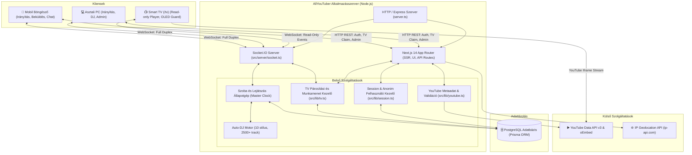
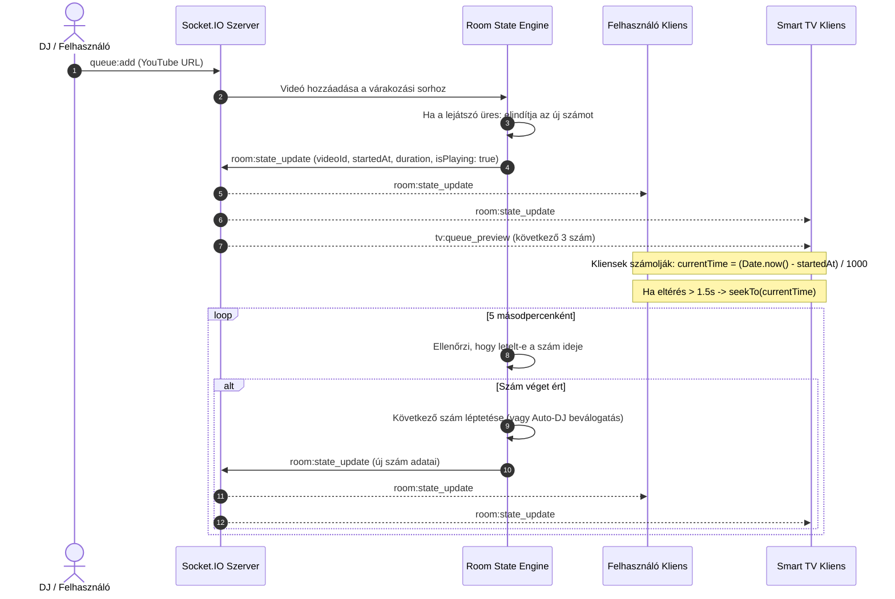
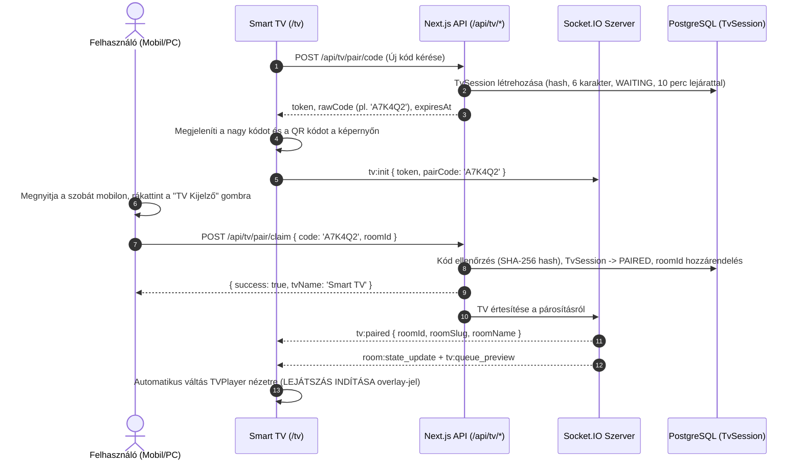

# AllYouTuber — Rendszerarchitektúra és Működési Terv

Ez a dokumentum részletesen bemutatja az **AllYouTuber** architektúráját, moduljait, adatfolyamait, adatbázis sémáit és Socket.IO protokolljait.

---

## 1. Rendszerarchitektúra Áttekintés

Az AllYouTuber egy hibrid **Next.js 14 App Router** és **Socket.IO Node.js** szerverre épül, amely egyetlen folyamatként fut. A perzisztens adatokat **PostgreSQL** tárolja **Prisma ORM** rétegen keresztül, míg a gyors szobakezelést és valós idejű szinkronizációt egy szerver oldali in-memory állapotgép biztosítja.

---

## 2. Valós Idejű Lejátszás Szinkronizáció (Master Clock Engine)

A videók szinkronizációja központi szerveridő (Master Clock) alapján történik.

---

## 3. Smart TV Párosítási és Kezelési Folyamat

---

## 4. Adatbázis Séma (Prisma Data Model)

Az adatbázis sémát a `prisma/schema.prisma` definiálja.

### Főbb modellek:

1. **User**:
   - `id`, `nickname`, `avatarUrl`, `role` (`GUEST`, `USER`, `ADMIN`, `OWNER`), `ipAddress`, `lastActiveAt`.
2. **Room**:
   - `id`, `name`, `slug`, `description`, `isPrivate`, `pinCode`, `djStyle`, `allowGuestDj`, `createdAt`.
3. **QueueItem**:
   - `id`, `roomId`, `userId`, `youtubeId`, `title`, `duration`, `thumbnailUrl`, `position`, `source` (`USER`, `AUTO_DJ`).
4. **ChatMessage**:
   - `id`, `roomId`, `userId`, `message`, `type` (`CHAT`, `SYSTEM`, `EMOTE`), `createdAt`.
5. **TvSession**:
   - `id`, `token` (egyedi azonosító token), `codeHash` (SHA-256 hashelt 6 karakteres kód), `status` (`WAITING`, `PAIRED`, `DISCONNECTED`, `EXPIRED`), `name` (pl. "Nappali TV"), `ipAddress`, `roomId` (külső kulcs), `expiresAt`, `createdAt`, `updatedAt`.
6. **AuditLog**:
   - `id`, `adminId`, `action`, `targetType`, `targetId`, `details`, `createdAt`.

---

## 5. Biztonság és Kliens-védelem

- **Read-Only TV Védelem**: A TV socketek `isTvClient: true` jelöléssel csatlakoznak a Socket.IO szerverre. A szerver automatikusan blokkol minden szobamódosító, szavazó vagy várakozási sor módosító eseményt a TV felől.
- **Brute Force Védelem**: A TV kódbeváltás 10 kérés/perc/IP cím korlátozással védett.
- **XSS és Sanitization**: Minden chat üzenet és szobanév DOMPurify / escape szűrésen esik át.
